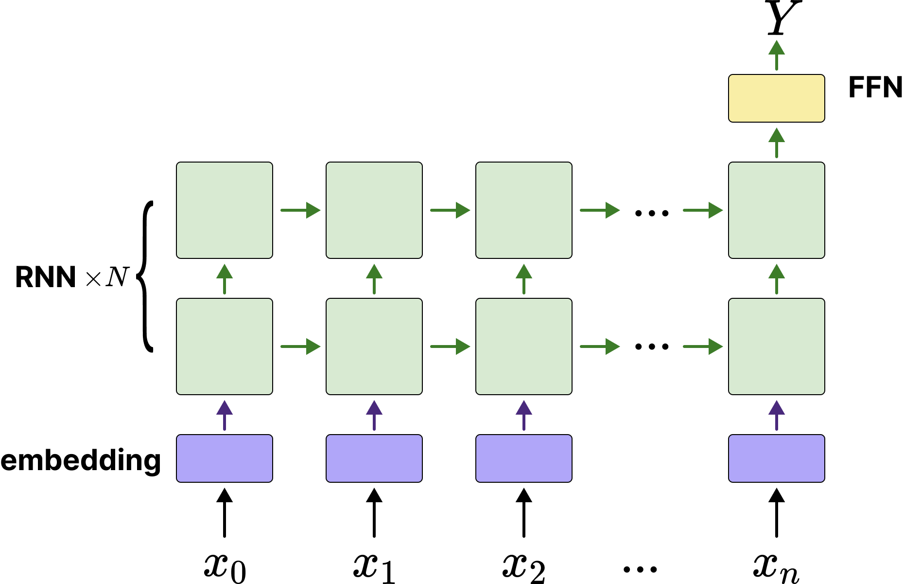
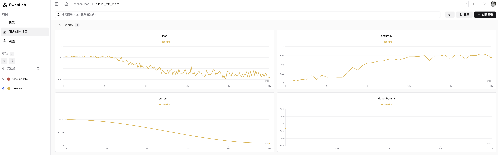
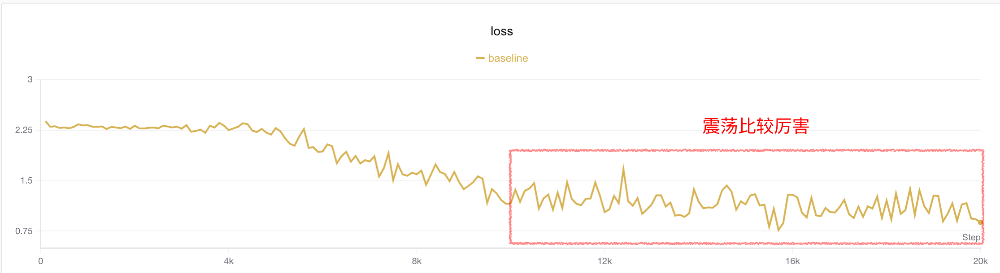
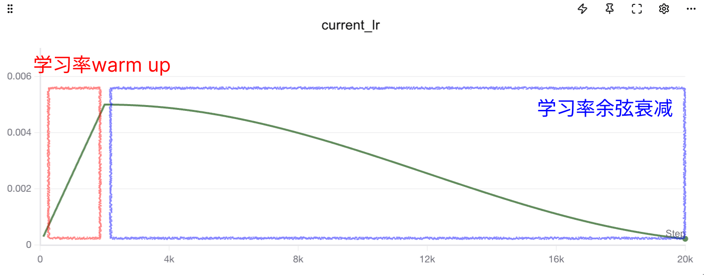

# 考古RNN篇：一文搞懂pytorch RNN如何处理可变长批次训练

## 写在前面

笔者最近研究线性注意力时，突然发现此前了解过RNN网络，但是没有细究RNN具体如何堆叠，训练时如何并行等细节。因此本博客将讲解pytorch下`torch.nn.RNN`的使用方法，重点关注如下两块：

* RNN如何堆叠，`num_layers`参数背后是什么结构，`bidirectional`参数的作用
* 对于可变序列输入来说，RNN如何进行batch训练

## 介绍RNN原理

先简单介绍下RNN的公式：

$$
h_t = \tanh(W_{xh} x_t + W_{hh} h_{t-1} + b_h)
$$

公式里面的关键变量：

* $ x_t $ ：时间步 $ t $ 的输入向量
* $ h_t $ ：时间步 $ t $ 的隐藏状态（hidden state）
* $ W_{xh} $ ， $ W_{hh} $ ， $ b_h $ ：就是模型的参数矩阵

笔者刚学RNN时一直弄不懂隐藏状态 $ h_t $ 和网络输出的关系（网上的图也比较乱，一会儿 $ h $ 一会儿 $ y $ 的），实际上对于RNN来说隐藏状态就是输出。隐藏状态和输出的更新关系可以用下图解释：

<div align="center">
  <figure>
  
  <p style="margin-top: 10px; font-size: 0.9em; color: #555; text-align: center;">将RNN的输入过程沿时间展开</p>
  </figure>
</div>

这里面重要的是对于RNN来说，隐变量直接输出作为RNN网络的输出，同时该输出与下一个序列token的输入相加，隐状态 $ h_t $ 与 $ x_t $ 的结合方式即为 $ \tanh $ 的输入：

$$
W_{xh} x_t + W_{hh} h_{t-1} + b_h
$$

pytorch官方实现的`torch.nn.RNN`模块支持输入如下参数

* input_size: 输入维度
* hidden_size: 隐藏层维度，历史无论输入多长序列，模型都会将其压缩到这个小的向量来表示
* num_layers: 多层RNN的层数，**后面讲解**
* nonlinearity: 非线性函数的选择，只支持输入`"tanh"`和`"relu"`两种，想用sigmoid得自己想办法实现
* bias: 是否开启偏置，也就是上面公式中的 $ b_h $
* batch_first: 是否为batchu输入，跟input_size的形状有关
* dropout: 是否给输出增加dropout
* bidirectional: 是否为双向RNN，**后面讲解**

一个典型的使用案例是这样：

```python
rnn = torch.nn.RNN(10, 20, 1) # 输入向量序列的维度为10维，隐藏层大小（也就是输出大小）为20维，RNN堆叠层数是1
input = torch.randn(5, 3, 10)   # 序列长度为5，batch大小为3的一个向量序列，每个向量维度为5
h0 = None  # 默认不需要输入第一个隐藏状态，不输入的话模型会自动初始化一个全0的隐藏向量
output, hn = rnn(input, h0) # 输出
print(output.shape) # torch.Size([5, 3, 20])    output中包含所有的隐藏状态：h_1,h_2,...,h_n
print(hn.shape) # torch.Size([1, 3, 20])    hn中仅包含最后一层的隐藏状态：h_n
```

这里也推荐读者看一下pytorch官方对于RNN的模块的介绍文档：

* 链接：<https://docs.pytorch.org/docs/stable/generated/torch.nn.RNN.html>

那接下来我们就介绍下`num_layers`参数的作用和`bidirectional`参数的作用。

### 多层RNN的堆叠

pytorch官方文档中对于`num_layers`参数的介绍如下：

>num_layers – Number of recurrent layers. E.g., setting num_layers=2 would mean stacking two RNNs together to form a stacked RNN, with the second RNN taking in outputs of the first RNN and computing the final results. Default: 1

用Qwen3翻译过来就是：

>num_layers —— 循环层的数量。例如，设置 num_layers=2 表示将两个 RNN 堆叠在一起形成一个堆叠 RNN，其中第二个 RNN 接收第一个 RNN 的输出并计算最终结果。默认值：1

实际上讲解的也非常不清楚，笔者查阅了不少博客，以及看官方的案例代码，最终理解了所谓的Stacked RNN就是如下这么一个结构：

<div align="center">
  <figure>
  
  <p style="margin-top: 10px; font-size: 0.9em; color: #555; text-align: center;">将RNN的输入过程沿时间展开，图来自[1]</p>
  </figure>
</div>

笔者也贴出对于多层堆叠RNN（Stacked RNN）的计算代码供读者参考（代码来自pytorch官方文档）：

```python
# Efficient implementation equivalent to the following with bidirectional=False
rnn = nn.RNN(input_size, hidden_size, num_layers)
params = dict(rnn.named_parameters())
def forward(x, hx=None, batch_first=False):
    if batch_first:
        x = x.transpose(0, 1)
    seq_len, batch_size, _ = x.size()
    if hx is None:
        hx = torch.zeros(rnn.num_layers, batch_size, rnn.hidden_size)
    h_t_minus_1 = hx.clone()
    h_t = hx.clone()
    output = []
    for t in range(seq_len):
        for layer in range(rnn.num_layers):
            input_t = x[t] if layer == 0 else h_t[layer - 1]
            h_t[layer] = torch.tanh(
                input_t @ params[f"weight_ih_l{layer}"].T
                + h_t_minus_1[layer] @ params[f"weight_hh_l{layer}"].T
                + params[f"bias_hh_l{layer}"]
                + params[f"bias_ih_l{layer}"]
            )
        output.append(h_t[-1].clone())
        h_t_minus_1 = h_t.clone()
    output = torch.stack(output)
    if batch_first:
        output = output.transpose(0, 1)
    return output, h_t
```

通过上面的代码，可以理解，output和h_t的关系：

* output表示，随着向量序列中各个向量的输入，每个向量对应的最后一层隐藏状态的变化，所以形状是`(序列长度, batch数, 隐藏状态维度)`
* h_t表示的是整个序列输入完，所有层的最后一个隐藏状态，所以形状是`(层数, batch数, 隐藏状态维度)`

### 双向RNN

双向RNN比较好理解，用直白的话说，就是为了让模型即能够从前往后理解序列，又能从后往前理解序列（有点像Bert和GPT的差异）。因此我弄两个相同的RNN，把序列正着输入到第一个RNN获得隐藏状态，再倒着输入第二个RNN获得隐藏状态。开启的方式是另`bidirectional`变量为True。

示意图如下：

<div align="center">
  <figure>
  
  <p style="margin-top: 10px; font-size: 0.9em; color: #555; text-align: center;">有两个RNN分别处理正向和反向序列，图来自[1]</p>
  </figure>
</div>

当然这里注意两个细节：

1. 开启`bidirectional`后模型会直接生成两份RNN参数，所以RNN模型参数会大一倍
2. `output`和`h_n`都会给两份（两个RNN各一份），上面参考图画的有点问题在于最后 $ y_0 $ 看起来好像是正向和反向RNN的隐藏状态向加，**实际上torch实现的RNN是直接把正向反向RNN的隐藏状态都返回出来的**。

## 基于RNN网络的序列处理模型设计

由于RNN模型结构自身的梯度爆炸问题等问题，基于RNN的网络显著少于LSTM。当然，无论是LSTM还是RNN、乃至transformers，对于序列处理的模型可以简单分为下图这几个类：

<div align="center">
  <figure>
  
  <p style="margin-top: 10px; font-size: 0.9em; color: #555; text-align: center;">不同结构的RNN网络，红色是输入，蓝色是输出（也是隐藏状态），绿色是RNN网络[2]</p>
  </figure>
</div>

上图绿色部分其实替换成LSTM、RNN、Transformers逻辑都是一样的。下面列举一个各个网络的作用：

* **one to one:** 一般没这个结构😂，跟全连接没区别了
* **one to many:** 早期的图像-文本模型会是这个结构，或者老一点的文本生成模型
* **many to many(encode-decode):** 早期非常流行的NLP网络架构，一般用于文本生成、翻译、序列预测等任务，很多LSTM都是这个架构（Bert可以勉强归入到这个架构，虽然不完全正确，但是设计思想比较近）
* **many to many:** 这个架构笔者见的少，但是一些翻译任务，序列特征提取（比如实时语音转文本）会使用类似的架构。包括近年流行的线性注意力模型可以不严谨的归类到这个

当然RNN本身的建模能力并不是特别强，所以流行的还是**encode-decode**架构，或者做一些简单的预测、分类任务使用**many to one**架构，本文后面的教程就是基于**many to one**架构。

> 梯度消失和爆炸问题：<https://en.wikipedia.org/wiki/Vanishing_gradient_problem>  
> 当然RNN结构本身还有并行效率低，长程理解能力差等问题，关于并行效率将在后面分析

## RNN对于可变长序列的处理问题

为了提升显卡的计算效率，以及梯度方向的准确性，训练一般是将一批序列打包成一个batch进行的，但是这会有一个问题。就是对于文本分类等任务，序列一般是长度不一的。

对于多个不同长度的序列x，我们通常使用padding的办法来将其填充到特定长度，再输入到网络中。

<div align="center">
  <figure>
  
  <p style="margin-top: 10px; font-size: 0.9em; color: #555; text-align: center;">填充方法，一般训练时是从右边填充（左边对齐）</p>
  </figure>
</div>

对于Transformers来说这个问题比较好解决，我们可以通过增加attention mask实现并行。但是对于LSTM、RNN这种网络。由隐藏状态 $ h_n $ 是随着每个序列逐步更新的。所以我们直接padding+batch输入就会出现隐藏状态 $ h_n $ 计算时包含了pad token的问题。

<div align="center">
  <figure>
  
  <p style="margin-top: 10px; font-size: 0.9em; color: #555; text-align: center;">使用常规的batch处理方法在RNN上对于pad token没法很好的处理</p>
  </figure>
</div>

好在pytorch工程师也考虑了这一点，弄了两个工具函数专门来帮助处理

* **pack_padded_sequence** 把填充后的batch和序列长度合成一个长序列：(seq,batch, dim) -> (seq*batch, dim)
* **pad_packed_sequence** 和上面的函数反过来，通常用于处理RNN的output结果：(seq*batch, dim) -> (seq,batch, dim)

这样一定程度上能实现并行计算，不过并行计算的效率自然还是很低（这也是RNN没法做大的原因之一）。不过终归是可以利用向量计算+流水线处理一定程度上加速了。

下面是`pack_padded_sequence`函数知乎大神画的示意图，我直接拿来用了：

<div align="center">
  <figure>
  
  <p style="margin-top: 10px; font-size: 0.9em; color: #555; text-align: center;">`pack_padded_sequence`函数处理方法[3]</p>
  </figure>
</div>

这里要说明下，pack_padded_sequence有一个参数`enforce_sorted`是默认开启的，这个意思是要求batch里的序列必须是从长到短排列的（为了在GPU上可以减少中断的计算）。然而实际上我们并不会在训练代码时每次对一个batch的数据排序，这里给指定为false就行，开不开启只影响模型导出onnx的行为。一般来说我们指定为false让pytorch自己处理即可。

有关pack_padded_sequence和pad_packed_sequence的使用案例代码如下（网上好多都是错的T_T，包括外网stack over flow上一些，大家可以参考这个笔者校对过的代码）

```python
import torch
import torch.nn as nn
from torch.autograd import Variable


input_dim=2
batch_size = 3
max_length = 4
hidden_size = 2
n_layers =1

# container
batch_in = torch.zeros(
    (
        batch_size,
        max_length,input_dim
    )
)

# data
vec_1 = torch.FloatTensor([[1, 1.1], [2, 2.2], [0, 0], [0, 0]])
vec_2 = torch.FloatTensor([[[1, 1.1], [2, 2.2], [3, 3.3], [4, 4.4]]])
vec_3 = torch.FloatTensor([[[1, 1.1], [0, 0], [0, 0], [0, 0]]])


# print(batch_in[0].shape)
batch_in[0] = vec_1
batch_in[1] = vec_2
batch_in[2] = vec_3

batch_in = Variable(batch_in)

seq_lengths = [4,2,1,] # list of integers holding information about the batch size at each sequence step

# pack it
pack = torch.nn.utils.rnn.pack_padded_sequence(batch_in, seq_lengths, batch_first=True,enforce_sorted=False)

print(pack)
# PackedSequence(data=tensor([[1.0000, 1.1000],
#         [1.0000, 1.1000],
#         [1.0000, 1.1000],
#         [2.0000, 2.2000],
#         [2.0000, 2.2000],
#         [0.0000, 0.0000],
#         [0.0000, 0.0000]]), batch_sizes=tensor([3, 2, 1, 1]), sorted_indices=tensor([0, 1, 2]), unsorted_indices=tensor([0, 1, 2]))
```

`pack`中会包含构建好的序列、batch大小信息（用于未来恢复）、以及排序信息。

那么对RNN进行批次前向传递和对ouput进行batch恢复的代码如下：

```python
# initialize
rnn = nn.RNN(input_dim, hidden_size, n_layers, batch_first=True)
h0 = Variable(torch.zeros(n_layers, batch_size, hidden_size))

# forward
out, h_n = rnn(pack, h0)

# unpack
unpacked, unpacked_len = torch.nn.utils.rnn.pad_packed_sequence(out ,batch_first=True)


print(unpacked)
# tensor([[[ 0.6948, -0.4382],
#          [ 0.5995,  0.0263],
#          [ 0.7160,  0.0732],
#          [ 0.7253,  0.1289]],

#         [[ 0.6948, -0.4382],
#          [ 0.5995,  0.0263],
#          [ 0.0000,  0.0000],
#          [ 0.0000,  0.0000]],

#         [[ 0.6948, -0.4382],
#          [ 0.0000,  0.0000],
#          [ 0.0000,  0.0000],
#          [ 0.0000,  0.0000]]], grad_fn=<IndexSelectBackward0>)
```

这里还是放一下两个函数的官方文档链接，推荐大家读一下：

* pack_padded_sequence文档：<https://docs.pytorch.org/docs/stable/generated/torch.nn.utils.rnn.pack_padded_sequence.html>
* pad_packed_sequence文档：<https://docs.pytorch.org/docs/stable/generated/torch.nn.utils.rnn.pad_packed_sequence.html>

除了这两个函数外，还有一个经常会用到的函数`pad_sequence`，将数据由不同长度的tensor list自动填充成一个batch。这个函数通常用于数据预处理

* pad_sequence文档：<https://docs.pytorch.org/docs/stable/generated/torch.nn.utils.rnn.pad_sequence.html>

<div align="center">
  <figure>
  
  <p style="margin-top: 10px; font-size: 0.9em; color: #555; text-align: center;">`pad_sequence`函数处理方法[3]</p>
  </figure>
</div>

## 训练任务简介

我们使用**序列和计算余数**的任务来验证RNN模型的性能表现。

**序列和计算余数**：数据集由输入-输出对 `(X, Y)` 构成，形式化定义如下：

* **模型输入 X**：  
  为一个任意长度 $ n \in \mathbb{N}^+ $ 的随机整数序列 $ X = (x_1, x_2, \dots, x_n) $，其中每个元素 $ x_i $ 独立同分布地从集合 $ \{0, 1, 2, \dots, 9\} $ 中均匀采样，即：

  $$
  x_i \overset{\text{i.i.d.}}{\sim} \text{Uniform}\{0, 1, \dots, 9\}, \quad \forall i = 1, \dots, n
  $$

* **目标输出 Y**：  
  为序列中所有元素之和对 10 取模的结果：

  $$
  Y = \left( \sum_{i=1}^{n} x_i \right) \bmod 10
  $$

下面是一些数据集案例：

| 模型输入 X                     | 计算过程                     | 目标输出 Y |
|-----------------------------|------------------------------|----------|
| `[3, 7, 1, 9]`              | (3+7+1+9) = 20 → 20 mod 10   | `0`      |
| `[5]`                       | 5 mod 10                     | `5`      |
| `[1,2,3,4,5,6,7,8,9,0]`     | 45 mod 10                    | `5`      |
| `[8, 8, 8]`                 | 24 mod 10                    | `4`      |

该任务可视为一个序列到标量的映射问题，目标是学习从任意长度数字序列到其各位数字和模 10 的映射函数。由于输入长度可变且元素随机，该数据集可用于测试RNN模型对变长序列的建模能力、模运算推理能力及泛化性能。

合成该数据集的pytorch代码如下：

```python
# 可变长数据集，X为一个0-N的序列，Y为该序列的求和除N+1的余数，范围也是0-N
class SeqSumModDataset(IterableDataset):
    def __init__(self, total_samples=None, min_seq_len=2, max_seq_len=5, max_number=4):
        """
        :param total_samples: 总样本数（None = 无限生成）
        :param min_len: 最短字母序列长度
        :param max_len: 最长字母序列长度
        :param max_number: 序列会出现的最大数字
        """
        self.total_samples = total_samples
        self.min_len = min_seq_len
        self.max_len = max_seq_len
        self.max_number = max_number
        self.count = 0  # 用于限制样本总数

    def __iter__(self):
        self.count = 0  # 每次重新迭代时重置计数器
        return self

    def __next__(self):
        # 用于控制epoch
        if self.total_samples is not None and self.count >= self.total_samples:
            raise StopIteration

        # 动态生成一个样本
        seq_length = random.randint(self.min_len, self.max_len)
        input_seq = [random.randint(0, self.max_number) for _ in range(seq_length)]
        target_num = sum(input_seq) % (self.max_number + 1)
        self.count += 1
        return input_seq, seq_length, target_num
```

## 构建预测模型

由于是一个“离散序列➡️离散数字”预测任务。因此可以看作一个序列分类任务。输入一个不定长离散序列，输出0-9这10个数字的类别。我们可以构建一个“many to one”的模型。笔者设计的模型架构如下：

<div align="center">
  <figure>
  
  <p style="margin-top: 10px; font-size: 0.9em; color: #555; text-align: center;">网络架构图，使用embedding将序列数字转换为向量，后跟多层RNN网络以及FFN分类头</p>
  </figure>
</div>

由上图可以看到，序列由embedding网络转换成向量，再输入多层堆叠的RNN网络，使用最后一层RNN的最后一个隐藏状态 $ h_n $ 来预测最后一个输入序列的求和。

当然可能读者会说为什么要弄一个embedding模型那么麻烦，直接把输入序列 $ x_i $ 处理成one-hot编码或者直接映射成浮点数不是更好吗？

实际上这两个做法都是对的hhh，不过笔者使用embedding模型配合是为了读者更好的理解自然语言中对于各个文本token序列是如何处理的。至于为什么没转换成标量，实际上标亮确实能让模型更快的收敛，毕竟数值不像字符，本身具备大小关系。考虑到RNN在自然语言上的表现相当优秀，因此笔者这么实现是方便未来这个网络能够更容易迁移到NLP任务当中。

网络代码实现如下：

```python
import torch.nn as nn
from torch.nn.utils.rnn import pack_padded_sequence

class RnnClsNet(nn.Module):
    """
    基于RNN的序列分类网络，适用于变长输入序列（如句子、数字序列等）。
    使用 Embedding + 多层RNN + 全连接层结构，最终输出分类概率。
    支持处理填充（padding）序列，通过 pack_padded_sequence 提高计算效率。
    """
    def __init__(self, vocab_size=5, embed_dim=5, hidden_dim=16, num_layers=2, cls_num=5):
        super().__init__()
        # Embedding层，注意指定最后一个序列为padding序列，因此词表大小要加1
        self.embedding = nn.Embedding(vocab_size + 1, embed_dim, padding_idx=-1)
        # RNN 层：处理变长序列，batch_first=True 表示输入形状为 (batch, seq_len, embed_dim)
        self.rnn = nn.RNN(
            embed_dim,           # 输入特征维度
            hidden_dim,          # 隐藏状态维度
            num_layers=num_layers,  # RNN 层数
            batch_first=True     # 输入/输出的第一个维度是 batch_size
        )
        self.rnn = nn.RNN(embed_dim, hidden_dim, num_layers=num_layers, batch_first=True)
        self.fc = nn.Linear(hidden_dim, cls_num)

    def forward(self, x, seq_lengths):
        # 词嵌入：将索引转换为向量
        embedded = self.embedding(x)  # 形状: (batch, seq_len, embed_dim)
        # 打包变长序列：提升 RNN 对 padding 部分的计算效率，避免无效计算
        pack = pack_padded_sequence(embedded, seq_lengths, enforce_sorted=False, batch_first=True)
        # RNN 前向计算
        out, h_n = self.rnn(pack)   # h_n 形状 (num_layers, batch, hidden_dim)
        # 取最后一层的最终隐藏状态作为序列表示
        out = self.fc(h_n[-1])  # 映射到分类空间，形状: (batch, cls_num)
        return out
```

笔者做了完整的注释方便读者理解模型具体怎么实现。

这里重点关注`forward`函数中使用`pack_padded_sequence`对输入序列进行打包，打包后padding token将被删除。

## 完整训练代码获取与运行

完整训练代码可以通过Github查看（后文也附了训练代码，防止有读者无法访问github，见[#附录：训练代码](#附录：训练代码)

* GitHub链接：<https://github.com/ShaohonChen/tutorial_with_rnn>

下载代码&环境安装命令：

```bash
git clone https://github.com/ShaohonChen/tutorial_with_rnn.git
cd tutorial_with_rnn
pip install torch swanlab
```

运行训练代码的命令如下：

```bash
python train_cls_rnn.py
```

由于模型比较小，一共也就不到1k的参数量，因此使用笔者自己的Mac笔记本电脑CPU运行两分钟即可完成训练。

运行效果如下：

<div align="center">
  <figure>
  
  <p style="margin-top: 10px; font-size: 0.9em; color: #555; text-align: center;">网络架构图，使用embedding将序列数字转换为向量，后跟多层RNN网络以及FFN分类头</p>
  </figure>
</div>

> 实验记录见：<https://swanlab.cn/@ShaohonChen/tutorial_with_rnn/charts>

可见模型基本在4k左右的训练步长时会突然出现“啊哈时刻🤪”，突然顿悟了怎么计算求余数，此后准确率飞速增长，到75%的准确率。

P.S. 笔者一开始设置只运行1k-2k steps。结果发现老收敛不了。后来拉大训练步骤后出现奇迹了。

> 如果提示输入swanlab api key可参考[swanlab登陆指南](https://docs.swanlab.cn/guide_cloud/general/quick-start.html)来使用SwanLab监控训练指标～ SwanLab是一个非常好用且免费的在线训练监控工具，希望大家能够多多支持。

<div align="center">
  <figure>
  
  <p style="margin-top: 10px; font-size: 0.9em; color: #555; text-align: center;">SwanLab工具，后面教程关于调参部分的实验结果可以在SwanLab上查看</p>
  </figure>
</div>

## 评估推理代码

上次笔者在写构建多模态模型的教程[Qwen-SmlVL](https://github.com/ShaohonChen/Qwen3-SmVL)时忘了传评估脚本，结果被issue疯狂diss。这次笔者乖乖提交了推理脚本。运行命令如下：

```bash
python predict_cls_rnn.py
```

运行效果如下：

<div align="center">
  <figure>
  
  <p style="margin-top: 10px; font-size: 0.9em; color: #555; text-align: center;">这次笔者认真附上了推理标准，再也不担心issue被抓🐦了</p>
  </figure>
</div>

> 感谢Qwen老师帮我写了推理脚本，并增加了详细的注释。

## 如何提升性能

不过目前准确率只到75%，也就是平均问4条错1条🤔。笔者想让模型准确率更高些，想到了如下两个策略：

### 策略一：增大batch

<div align="center">
  <figure>
  
  <p style="margin-top: 10px; font-size: 0.9em; color: #555; text-align: center;">baseline后半段损失震荡比较大</p>
  </figure>
</div>

笔者观察到在4k步以后的训练损失有点震荡。一个直观的思想是增加batch大小减少抖动。笔者将batch大小从16➡️64（当然这也引入了更多的数据集）。实验结果如下：

<div align="center">
  <figure>
  
  <p style="margin-top: 10px; font-size: 0.9em; color: #555; text-align: center;">黄色是baseline，蓝色是batch增大了4倍的训练效果，结果准确率更低了</p>
  </figure>
</div>

可见确实损失抖动较之前小了点，但是精度反而下来了。笔者怀疑这是因为陷入了局部最优解。那么既然batch增大了，理论上也可以通过增大lr来让模型跳出局部最优。

### 策略二：增大batch和学习率Lr

接着把LR从1e-3提升到5e-3

```bash
python train_cls_rnn.py --batch_size 64 --lr 0.005 --run_name large_batch_lr5e-3
```

> * 💡 按照scaling law法则，batch增大四倍学习率也该增加近似4倍，但是笔者觉得4e-3不吉利哈哈哈哈🤣，其实差不多只要数量级别差太远就行，超参数没那么敏感。关于batch和lr的关系并不是严格的线性，但是一般小模型可以近似理解为线性。  
> * 关于学习率和batch size的关联，建议大家阅读OpenAI的经典之作《An Empirical Model of Large-Batch Training》[4]，其证明了SGD优化器下batch size和学习率的关系是单调有界，在两者都比较小时学习率和batch size基本为**线性关系**。

效果如下⬇️

<div align="center">
  <figure>
  
  <p style="margin-top: 10px; font-size: 0.9em; color: #555; text-align: center;">黄色是baseline，品红色是增大学习率的曲线</p>
  </figure>
</div>

> 实验记录见：<https://swanlab.cn/@ShaohonChen/tutorial_with_rnn/charts>

一条漂亮的损失曲线！不仅提前收敛了，并且准确率来到了91%！😄

不过仍然不够，这个任务理论上有更优的解。

### 策略二：Scaling Law（直接加大模型）

这个原理很好理解，实际上对于任意长度的序列求和去余，RNN并不需要记住蓄力的所有数字，也不需要学会求余数的数学公式。

一个比较讨巧的策略是：由余数倒退所有和不超过10的整数加法组合也是一个有限集，模型只需要把这个有限集的范围背下来即可。笔者粗估了一下这个组合关系小于10的平方除2，也就50多个组合。

那么简单好懂的思维是，增加模型的大小，让他的记忆变大。

增大模型规模的训练脚本：

```bash
python train_cls_rnn.py --hidden_dim 32 --num_layers 3  --run_name deeper_rnn
```

结果可谓立竿见影，准确率直接冲到了99%🎉（99%-97波动）

<div align="center">
  <figure>
  
  <p style="margin-top: 10px; font-size: 0.9em; color: #555; text-align: center;">黄色是baseline，绿色是更深更大的RNN网络，可见加深网络后准确率峰值达到了99%</p>
  </figure>
</div>

> 实验记录见：<https://swanlab.cn/@ShaohonChen/tutorial_with_rnn/charts>

当然可以看到虽然模型训练的更为滞后，但是这仍带来了明显的收益。

### SOTA模型的诞生：组合策略带来的性能提升

那么直观的思考就是我把所有trick加起来，效果一定更好

```bash
python train_cls_rnn.py --hidden_dim 32 --num_layers 3  --batch_size 64 --lr 0.005  --run_name sota
```

结果发现模型并不如人意，更为痛苦的是，笔者连跑了三个模型，发现有一个居然收敛了？？？（笔者意思到自己忘固定随机种子了😭）

> ⚠️大家以后自己训练务必记得记录随机种子，笔者也给SwanLab提PR希望增加自动随机种子记录，防止未来实验复线不了

<div align="center">
  <figure>
  
  <p style="margin-top: 10px; font-size: 0.9em; color: #555; text-align: center;">黄色是baseline，三个组合别的sota策略发现有一个是收敛的</p>
  </figure>
</div>

> 实验记录见：<https://swanlab.cn/@ShaohonChen/tutorial_with_rnn/charts>

笔者进一步分析实验结果，发现相比于收敛的实验，不收敛的模型在loss初期存在一个明显的震荡。这里还是带货一下SwanLab，如果不做数值分析真的找不出这些问题;-)

<div align="center">
  <figure>
  
  <p style="margin-top: 10px; font-size: 0.9em; color: #555; text-align: center;">相比于收敛的实验，另两个不收敛实验损失在初期震荡严重</p>
  </figure>
</div>

考虑到RNN结构本身对梯度传递不太友好，那么只需要消除掉训练前期的损失震荡问题即可（后面没震荡不代表收敛了，单纯使用了余弦学习率衰减学习率下来了）

> 💡关于RNN为什么震荡比较推荐苏神（Su Jianlin）的手推教程：<https://spaces.ac.cn/archives/7888>

包括梯度截断、换优化器、网络增加跨层链接或者门控都是选项。以及在LLM比较流行的策略，**前期增加学习率warm up**。

<div align="center">
  <figure>
  
  <p style="margin-top: 10px; font-size: 0.9em; color: #555; text-align: center;">学习率warm up + 余弦衰减</p>
  </figure>
</div>

这里介绍一下warm up这个技巧，学习率 Warmup 是一种在训练初期逐步增加学习率的优化策略。其核心思想是：在模型训练刚开始时，参数尚未稳定，若直接使用较大的学习率，容易导致梯度震荡、训练不稳定甚至发散。Warmup 通过在前若干个训练步（或 epoch）中，从一个极小的学习率线性（或指数）增长到目标学习率，使模型参数“温和启动”，从而提升训练稳定性与最终收敛性能。

那么增加了warmup后，训练命令如下：

```bash
python train_cls_rnn.py --hidden_dim 32 --num_layers 3  --batch_size 64 --lr 0.005 --warmup_step 2000  --run_name sota_warmup
```

Bingo！这次模型非常稳定的实现了收敛，笔者重复了三次实验也没发现无法收敛的情况！

并且准确率也来到了惊人的100%，因为测试集每次是随机生成100%，理论上不存在过拟合的问题。

> 实验记录见：<https://swanlab.cn/@ShaohonChen/tutorial_with_rnn/charts>

<div align="center">
  <figure>
  
  <p style="margin-top: 10px; font-size: 0.9em; color: #555; text-align: center;">增加warm up策略后的实验，可以看到三次实验模型都稳定收敛</p>
  </figure>
</div>

<div align="center">
  <figure>
  
  <p style="margin-top: 10px; font-size: 0.9em; color: #555; text-align: center;">warm up后训练前期的稳定性提升了不少</p>
  </figure>
</div>

### 评估效果

对模型进行推理，发现整体表现还是相当喜人的，而且有一定的外推能力，模型训练时序列长度为2-5，但是推理时超过10个数字模型依然能准确计算hhh。

<div align="center">
  <figure>
  
  <p style="margin-top: 10px; font-size: 0.9em; color: #555; text-align: center;">效果图</p>
  </figure>
</div>
、
<div align="center">
  <figure>
  
  <p style="margin-top: 10px; font-size: 0.9em; color: #555; text-align: center;">超文本长度外推表现也不错</p>
  </figure>
</div>

## 参考

* [1] <https://www.researchgate.net/figure/Stacked-RNN-Generalized-structure-and-temporal-unrolled-variant_fig4_376204636>

* [2] <https://medium.com/data-science/pytorch-basics-how-to-train-your-neural-net-intro-to-rnn-cb6ebc594677>

* [3] <https://zhuanlan.zhihu.com/p/601705984>

* [4] <https://papers.cool/arxiv/1812.06162>
